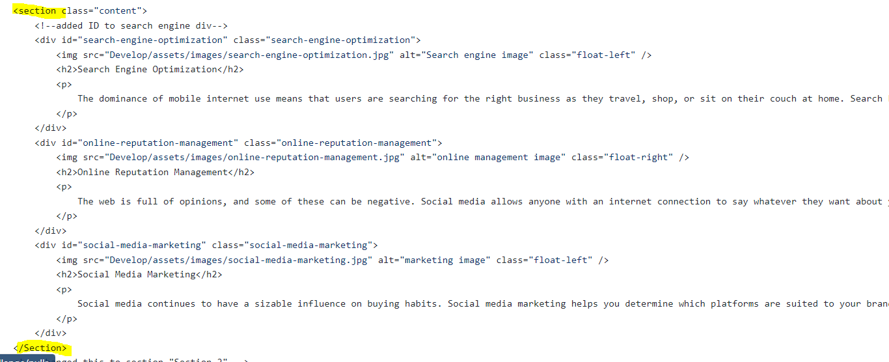

Horsen The Offical Website

Please use this file as a reference while navigating the site. There have been new updates made for accessibility.

USAGE
Please visit https://github.com/tlor0026/Module-1-Challenge for the HTML and CSS files.

1. Our Company Name :Title

2. Navigation Bar: clicking on each link will bring you to its designated area.

3. We've added "alt" information tied to our images for image attrubutions.

4. We've also gone ahead and resturctured our html elements along with consolidating some of our CSS elements (put everything into sections accordingly) for accessibility standards, seos.

5. Changes to some of the HTML semantic HTML Elements as well.

CREDITS
Alot of changes implemented was learned through our module https://umn.bootcampcontent.com/University-of-Minnesota-Boot-Camp/UofM-VIRT-BO-FSF-PT-04-2022-U-B
